# ProductiveFamily — منتجة

ProductiveFamily is an Android application designed to connect customers with productive families offering homemade food products.

The application supports three user roles: customers, productive families, and drivers. It includes product browsing, regular and customized orders, order management, delivery tracking, and product ratings.
## Problem and Solution

### Problem
Customers may find it difficult to discover nearby productive families, browse their available products, place customized orders, and track the order process through one organized platform.

Productive families also need a simple way to display their products, receive and manage orders, and coordinate deliveries.

### Solution
ProductiveFamily provides a centralized Android application that connects customers, productive families, and drivers.

Customers can browse products, place regular or customized orders, manage their orders, and submit ratings. Productive families can manage products and orders, while drivers can view assigned deliveries and update their delivery status.

## Key Features

### Customer
- Create an account and verify the phone number.
- Browse products by category.
- View product details, prices, ratings, and productive-family information.
- Place regular orders and adjust product quantities.
- Submit customized food requests.
- View active, delivered, and canceled orders.
- Update profile information.
- Rate products after delivery.

### Productive Family
- Display and manage available products.
- Add or update product information, prices, descriptions, and categories.
- Receive and review customer orders.
- Assign accepted orders to available drivers.
- Track order progress.

### Driver
- View assigned delivery orders.
- Update availability status.
- Access customer and productive-family delivery information.
- Mark orders as delivered.

## Technologies Used

- **Java** — Application logic and user interactions.
- **XML** — Android layouts and interface design.
- **Android Studio** — Development, building, testing, and debugging.
- **Android SDK** — Core Android application components.
- **Firebase Authentication** — User registration, login, and phone-number verification in the original implementation.
- **Firebase Realtime Database / Firestore** — Storing and managing application data.
- **Material Design Components** — Interface elements and form components.
- **ConstraintLayout** — Responsive Android screen layouts.
- **Gradle** — Project configuration and dependency management.
## Technologies Used

- **Java** — Application logic and user interactions.
- **XML** — Android layouts and interface design.
- **Android Studio** — Development, building, testing, and debugging.
- **Android SDK** — Core Android application components.
- **Firebase Authentication** — User registration, login, and phone-number verification in the original implementation.
- **Firebase Realtime Database / Firestore** — Storing and managing application data.
- **Material Design Components** — Interface elements and form components.
- **ConstraintLayout** — Responsive Android screen layouts.
- **Gradle** — Project configuration and dependency management.

## Screenshots

The following screenshots are from the original tested graduation-project prototype and use demonstration data.

### Authentication

  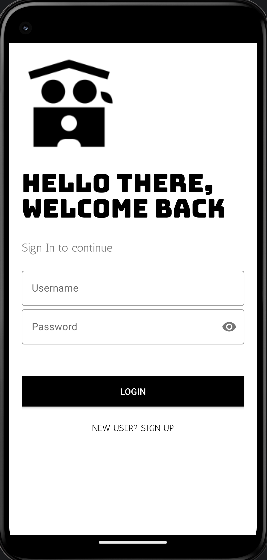
  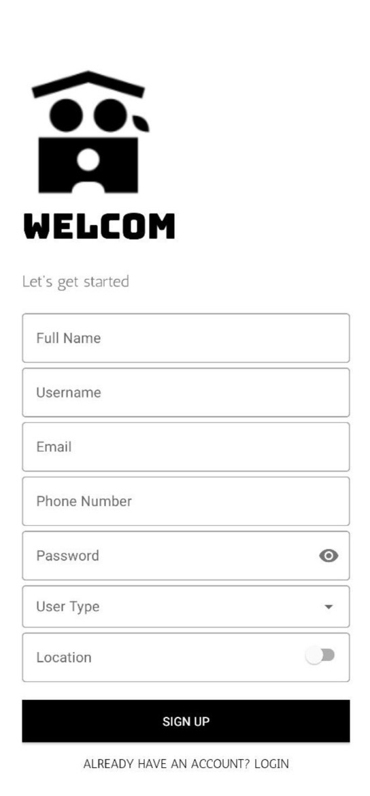
  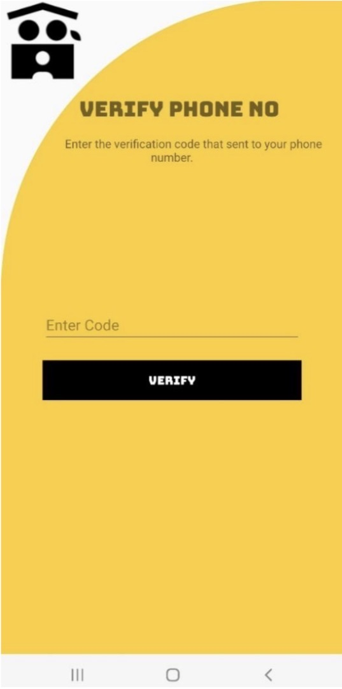

### Customer Experience

  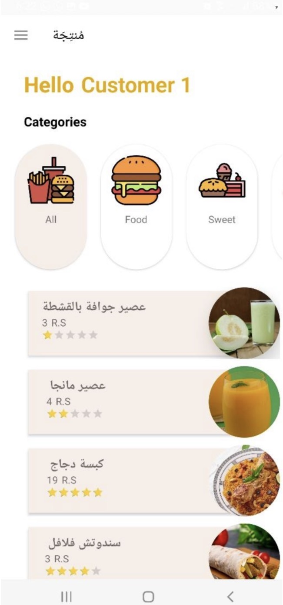
  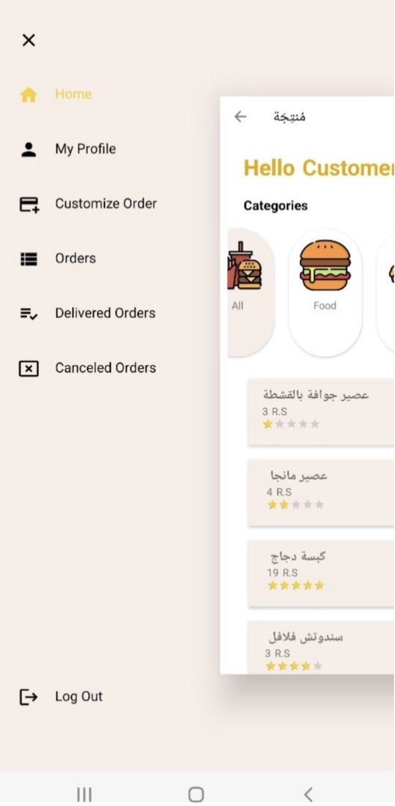
  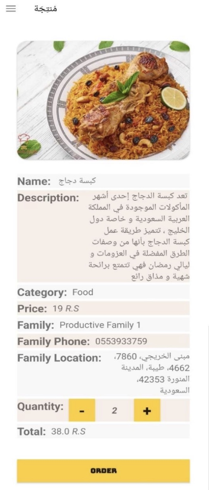

  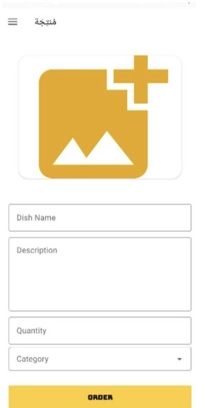
  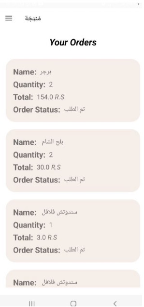
  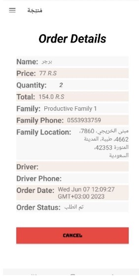

  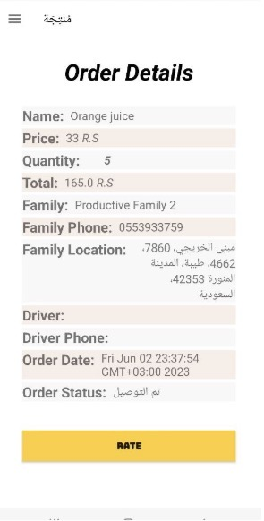
  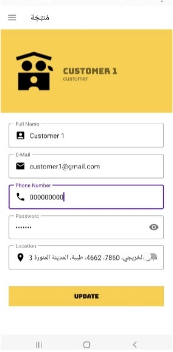
  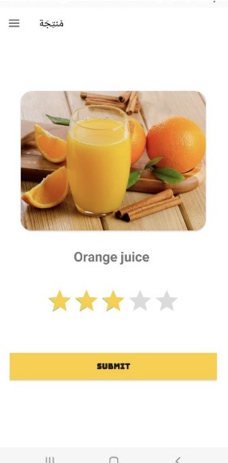

### Productive Family Experience

  
  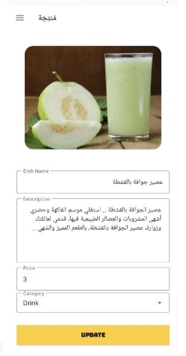
  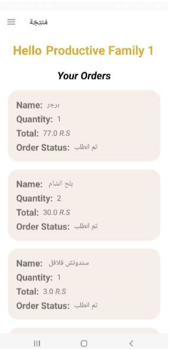

  

### Driver Experience

  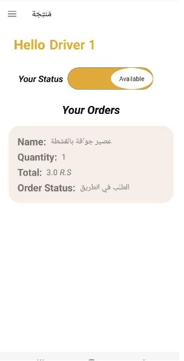
  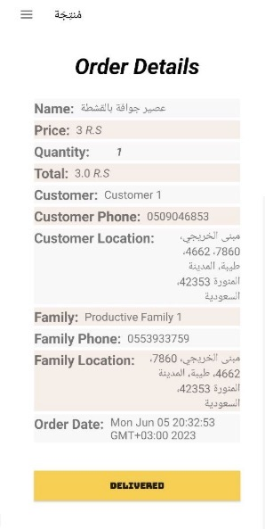

## System Design

### Development Methodology

The project followed the Waterfall software development model, beginning with requirements analysis and continuing through design, implementation, testing, and maintenance.

  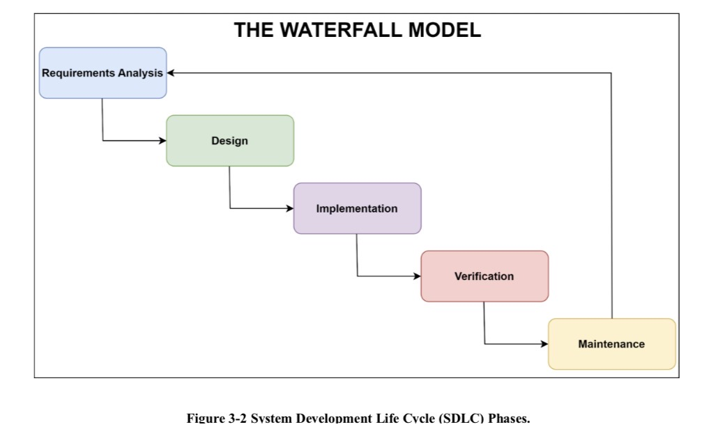

### Entity Relationship Diagram

The following diagram presents the main entities and relationships used in the application database.

  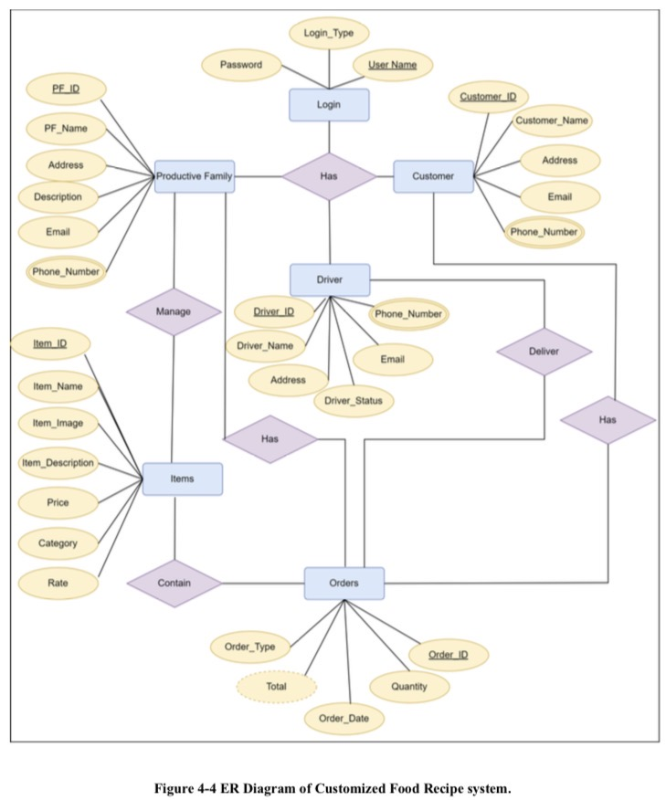

## Current Project Status

This repository contains a restored version of the original project and is currently being prepared for portfolio use.

- The project builds successfully in Android Studio.
- The application launches and displays the authentication interface.
- The original Firebase configuration file (`google-services.json`) is not available in the restored project copy.
- Because Firebase is not currently connected, authentication and database-dependent features such as registration, login, phone verification, orders, and delivery updates are not fully functional.
- Attempting to create a new account may cause the application to become unresponsive.
- The screenshots included in this repository were captured from the original tested prototype and contain demonstration data.
- Reconnecting Firebase and testing the complete user flows may be completed later in a separate development branch.

## Skills and Experience Gained

Working on ProductiveFamily gave me practical experience in developing a complete Android application with multiple user roles and connected workflows.

Through this project, I learned how to:

- Translate user requirements into application screens and workflows.
- Design separate experiences for customers, productive families, and drivers.
- Build Android interfaces using Java and XML.
- Connect application features with Firebase authentication and database services.
- Manage product, order, delivery, and rating data.
- Test complete user journeys across different roles.
- Organize and document a software project for future maintenance.
- Recognize the importance of version control, secure configuration management, and reliable project backups.

Restoring the project later also helped me understand how important clear documentation and repository organization are for maintaining and presenting software projects.